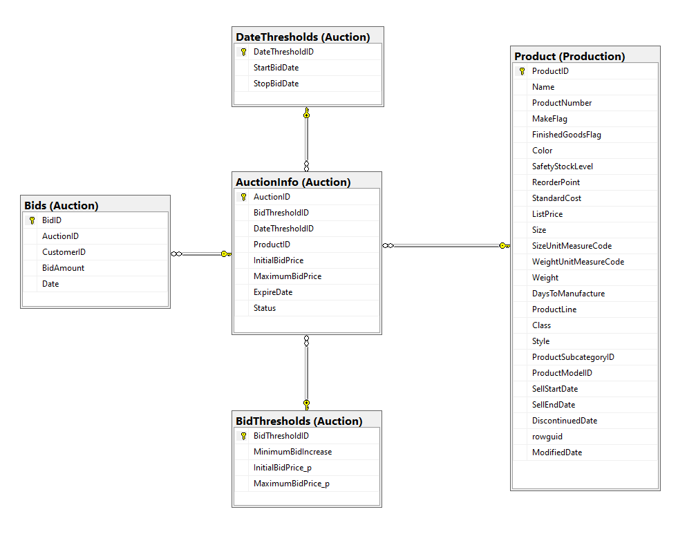

# Schema

# FAQ Notes

1 - InitialBidPrice MAX = Maximum Bid Limit (LIstprice -50% ou 75%)
2 - If above limitdate set status as ended

4 - Increment + last bid = Total Price
5 - Global threshold table
7 - Always start at 13th nov

9 - No neeed to subtract inventory
13
98/5
when product is initially added to auction:
-Products can be added to auction at any time that is earlier than StopBidDate value,
 however products can only receive bids after StartBidDate.

when product can effectively be bided:
-13th November and StopBidDate to 26th November
-these values should be configurable so means can be easily modified by changing the configuration table only

when auction is closed either because expire date was reached or max bid limit was reached:

-@ExpireDate parameter no errors should be returned if a product is added to auction AFTER @ExpireDate

- StopBidDate default value is 26th of November then no bids will be allowed AFTER
- extend auction one more week (which means updating StopBidDate value to 3th December) that means some auctions might
  still receive bids assuming neither expiration time nor max bid limit was reached.

# Error Handling

## **uspAddProductToAuction**

1. Ensure
   that the **@ProductID** parameter is a valid product ID and that the product exists in the
   database.
2. Ensure that there is no other active auction for the same  **@ProductID** .
3. Ensure that the product is currently commercialized (both **SellEndDate** and **DiscontinuedDate** values not set).
4. Ensure that the **@ExpireDate** parameter, if provided, is a valid datetime value and is not in the past.
5. Ensure that the **@InitialBidPrice** parameter, if provided, is a valid **money** value and is not less than the minimum bid price for the product, as determined by its **MakeFlag** value.
6. Ensure that the **@InitialBidPrice** parameter, if provided, is not greater than the maximum bid price for the product, as determined by its listed price.
7. Ensure that the bid increments are not less than the minimum bid increment as specified in the configuration table.
8. Ensure that the bid increments are not greater than the maximum bid limit as specified in the configuration table.
9. Ensure that the auction end time is not during the period of high workload, such as Black Friday, to ensure website reliability under high workload.
10. Handle any other exceptions or errors that may occur during the execution of the stored procedure.

## uspTryBidProduct

1. Invalid ProductID or CustomerID: You should check if the ProductID and CustomerID values are valid before proceeding with the bid. If either value is invalid, you should raise an error and provide an appropriate error message to the user.
2. Invalid BidAmount: If a bid amount is provided in the @BidAmount parameter, you should validate that it is a valid money value and within the allowed bid range (i.e., between the current highest bid plus the minimum increase bid and the maximum bid limit). If the bid amount is invalid or outside of the allowed range, you should raise an error and provide an appropriate error message to the user.
3. Invalid Threshold Configuration: If the thresholds configuration table is not properly configured, it may result in invalid bid ranges or other errors. You should check that the table exists and that the threshold values are valid before proceeding with the bid. If the thresholds configuration is invalid, you should raise an error and provide an appropriate error message to the user.
4. Concurrency Issues: If multiple users try to bid on the same product at the same time, there may be concurrency issues that need to be handled. You should use appropriate locking mechanisms (e.g., row-level locking) to ensure that only one bid is processed at a time. If a concurrency issue occurs, you should retry the bid after a short delay.
5. Database Errors: Finally, you should handle any unexpected database errors that may occur during the bid process. This includes errors such as network failures, out-of-memory errors, and other database-related issues. You should catch these errors and provide an appropriate error message to the user, and ensure that the bid transaction is rolled back to maintain data integrity.

## Decisions

- make transaction or not:
  - uspUpdateProductAuctionStatus
  - uspRemoveProductFromAuction
  - uspAddProcuctToAuction

BEGIN TRY
BEGIN TRANSACTION

COMMIT TRANSACTION
END TRY
BEGIN CATCH
IF @@TRANCOUNT > 0
BEGIN
ROLLBACK TRANSACTION
END
RAISERROR('It''s wasn''t possible to place your bid', 16, 1);
END CATCH;
END
GO
